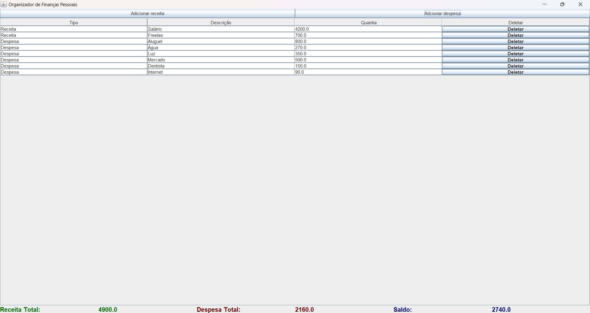

# Organizador Financeiro

Projeto de Extensão feito como trabalho final da disciplina "Programação Orientada a Objetos em Java" do curso de Engenharia de Software da Estácio.

## Tecnologia Utilizada

- Java
- Java Swing

## Screenshot

